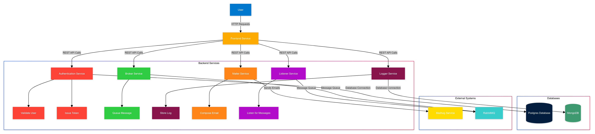

# Project Setup Guide

This guide will walk you through the setup of a multi-service application using Docker Compose. The architecture involves several services that work together to create a fully functional application stack.

## Architecture Overview

Here’s an overview of the services involved in the setup:

# Steps for the Guide

This document provides a detailed overview of running the demo using docker compose.

[Steps Guide](SETUP_GUIDE.md)

# Services Overview

This document provides a detailed overview of each service defined in the Docker Compose configuration. Each service plays a specific role in the application architecture.

## 1. Frontend Service

- **Purpose**: Provides the user interface for interacting with the application.
- **Dockerfile Path**: `./frontend-service.dockerfile`
- **Build Context**: `./frontend`
- **Port Mapping**: `80:3000` (Host Port: Container Port)
- **Dependencies**:
  - Broker Service
  - Mailhog
  - MongoDB
  - Postgres
  - Listener Service
  - Authentication Service
  - Logger Service
  - Mailer Service

## 2. Broker Service

- **Purpose**: Handles message brokering between various services.
- **Dockerfile Path**: `./broker-service.dockerfile`
- **Build Context**: `./broker-service`
- **Port Mapping**: `8080:80` (Host Port: Container Port)
- **Dependencies**: RabbitMQ

## 3. Logger Service

- **Purpose**: Manages application logs and stores them in MongoDB.
- **Dockerfile Path**: `./logger-service.dockerfile`
- **Build Context**: `./logger-service`
- **Dependencies**: MongoDB

## 4. Mailer Service

- **Purpose**: Manages the sending of emails using Mailhog.
- **Dockerfile Path**: `./mail-service.dockerfile`
- **Build Context**: `./mail-service`
- **Environment Variables**:
  - `MAIL_DOMAIN`: localhost
  - `MAIL_HOST`: mailhog
  - `MAIL_PORT`: 1025
  - `MAIL_ENCRYPTION`: none
  - `MAIL_USERNAME`: ""
  - `MAIL_PASSWORD`: ""
  - `FROM_NAME`: Mohan Raj
  - `FROM_ADDRESS`: mohan18.welcome@example.com
- **Dependencies**: Mailhog

## 5. Authentication Service

- **Purpose**: Manages user authentication and connects to the Postgres database.
- **Dockerfile Path**: `./authentication-service.dockerfile`
- **Build Context**: `./authentication-service`
- **Port Mapping**: `8081:80` (Host Port: Container Port)
- **Environment Variables**:
  - `DSN`: `host=postgres port=5432 user=postgres password=password dbname=users sslmode=disable timezone=UTC connect_timeout=5`
- **Dependencies**: Postgres

## 6. Listener Service

- **Purpose**: Listens for events and interacts with the Logger Service.
- **Dockerfile Path**: `./listener-service.dockerfile`
- **Build Context**: `./listener-service`
- **Environment Variables**:
  - `LOG_SERVICE_URL`: `http://logger-service/log`
- **Dependencies**: RabbitMQ

## 7. Postgres

- **Purpose**: The database for storing user information.
- **Image**: `postgres:15.4`
- **Port Mapping**: `5432:5432` (Host Port: Container Port)
- **Environment Variables**:
  - `POSTGRES_USER`: postgres
  - `POSTGRES_PASSWORD`: password
  - `POSTGRES_DB`: users
- **Volumes**: `./db-data/postgres/:/var/lib/postgresql/data/`

## 8. MongoDB

- **Purpose**: Stores logs from the Logger Service.
- **Image**: `mongo:6.0.3`
- **Port Mapping**: `27017:27017` (Host Port: Container Port)
- **Environment Variables**:
  - `MONGO_INITDB_DATABASE`: logs
  - `MONGO_INITDB_ROOT_USERNAME`: admin
  - `MONGO_INITDB_ROOT_PASSWORD`: password
- **Volumes**: `./db-data/mongo/:/data/db`

## 9. Mailhog

- **Purpose**: Simulates an email server for development.
- **Image**: `mailhog/mailhog:v1.0.1`
- **Port Mapping**:
  - `1025:1025` (SMTP)
  - `8025:8025` (Web Interface)

## 10. RabbitMQ

- **Purpose**: Provides a message queue for communication between services.
- **Image**: `rabbitmq:3.11-alpine`
- **Port Mapping**: `5672:5672` (Host Port: Container Port)
- **Volumes**: `./db-data/rabbitmq/:/var/lib/rabbitmq/`

## Conclusion

This overview outlines the key aspects of each service in your Docker Compose setup, including their purposes, configurations, and dependencies. Each service is designed to fulfill a specific role, and together they form a comprehensive system that can handle various application needs.

